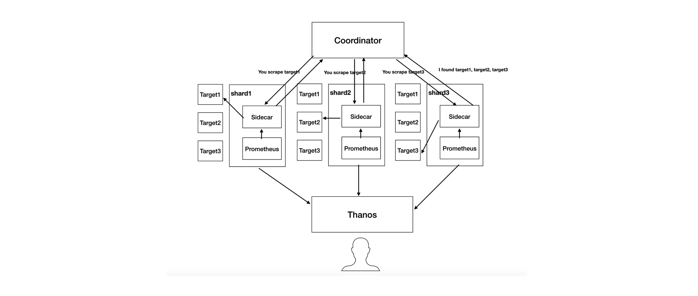
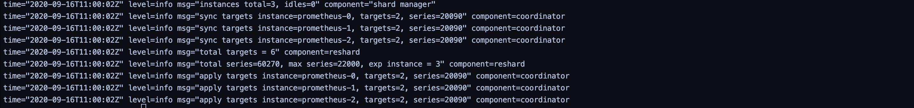

# Kvass

  [](https://goreportcard.com/report/github.com/tkestack/kvass)      []()
------

Kvass provides a method of Prometheus sharding, which uses Sidecar to generate new config only use "static_configs" for Prometheus scraping according to targets assigned from Coordinator
A Coordinator manage all shards  and assigned targets to each of them。
Thanos (or other storage solution) is used to provide a global data view。



------

## Feature

* Tens of millions series supported (thousands of k8s nodes)
* One configuration file
* Dynamic scaling
* Sharding according to the actual target load instead of label hash
* multiple replicas supported

## Quick start 

clone kvass to local 

> git clone https://github.com/tkestack.io/kvass

install example (just an example with testing metrics)

> Kubectl create -f ./examples

you can found a Deployment named "metrics" with 6 Pod, each Pod will generate 10045 series (45 series from golang default metrics) metircs。

we will scrape metrics from them。


the max series each Prometheus Shard can scrape is a flag of Coordinator Pod.

in the example case we set to 30000.

> ```
> --shard.max-series=30000
> ```

now we have 6 target with 60000+ series  and each Shard can scrape 30000 series，so need 3 Shard to cover all targets.



now Coordinator  automaticly change replicate of Prometheus Statefulset to 3 and assign targets to them.


only 20000+ series in prometheus_tsdb_head of one Shard


but we can get global data view use thanos-query


## Multiple replicas

Coordinator use label selector to select shards StatefulSets, every StatefulSet is a replica, Kvass puts together Pods with same index of different StatefulSet into one Shards Group.

> --shard.selector=app.kubernetes.io/name=prometheus

## Build binary

> git clone https://github.com/tkestack.io/kvass
>
> cd kvass
>
> make 

## Design

you can found design details from [design doc](./documents/design.md)

## License
Apache License 2.0, see [LICENSE](./LICENSE).

