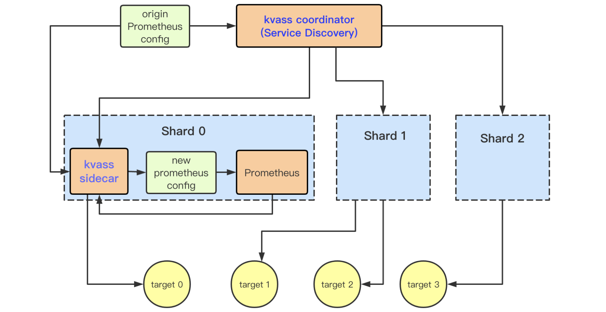
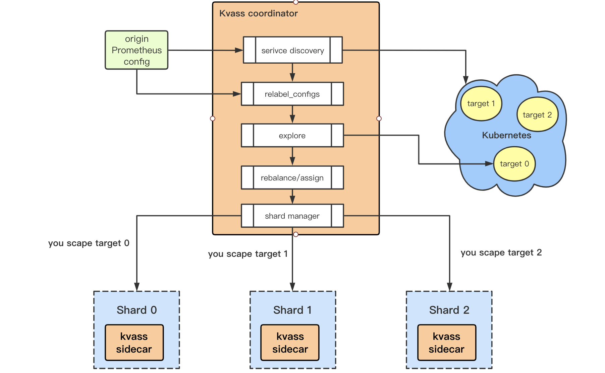
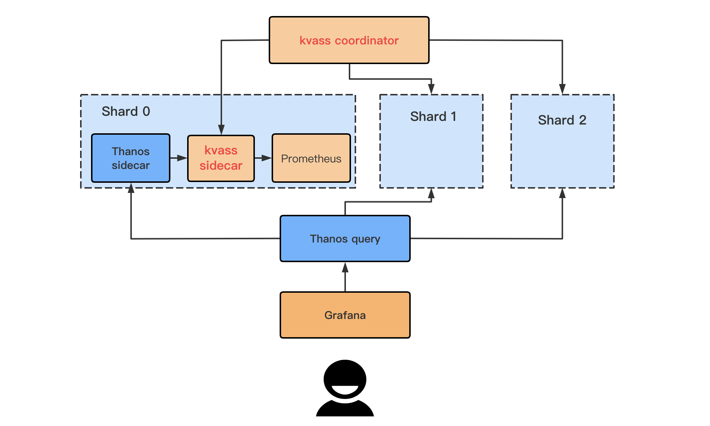
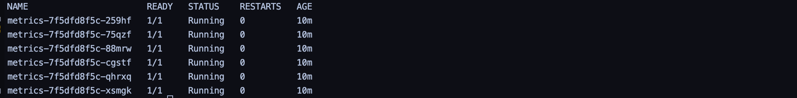
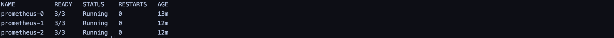
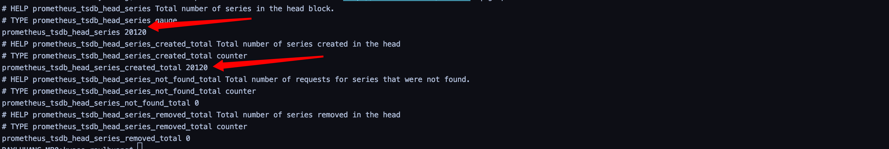
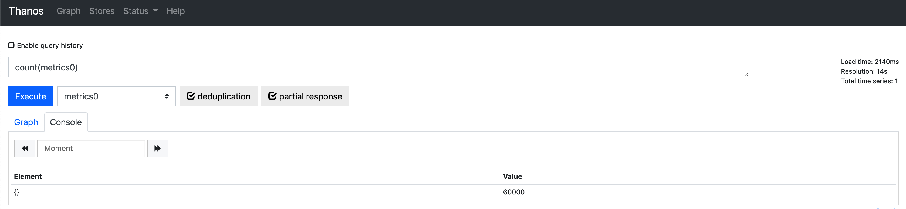

<div align=center></div>

[中文版](./README_CN.md)

Kvass is a [Prometheus](https://github.com/prometheus/prometheus) horizontal auto-scaling solution ,  which uses Sidecar to generate special config file only containes part of targets assigned from Coordinator for every Prometheus shard.

Coordinator do service discovery, Prometheus shards management and assign targets to each of shard.
[Thanos](https://github.com/thanos-io/thanos) (or other storage solution) is used for global data view.

  [](https://goreportcard.com/report/github.com/tkestack/kvass)  []()   [](https://codecov.io/gh/tkestack/kvass)

------

# Table of Contents
   * [Overview](#overview)
   * [Design](#Design)
      * [Components](#components)
         * [Coordinator](#coordinator)
         * [Sidecar](#sidecar)
      * [Kvass + Thanos](#kvass--thanos)
      * [Kvass + Remote storage](#kvass--remote-storage)
      * [Multiple replicas](#multiple-replicas)
      * [Targets transfer](#Targets-transfer)
      * [Shard de-pressure](#Shard-de-pressure)
      * [Shard scaling down](#Shard-scaling-down)
      * [Limit shards number](#Limit-shards-number)
      * [Target scheduling strategy](#Target-scheduling-strategy)
   * [Demo](#Demo)
   * [Best practice](#Best-practice)
      * [Flag values suggestion](#Flag-values-suggestion)
   * [License](#license)


# Overview

Kvass is a Prometheus horizontal auto-scaling solution with following features. 

* Easy to use
* Tens of millions series supported (thousands of k8s nodes)
* One prometheus configuration file
* Auto scaling
* Sharding according to the actual target load instead of label hash
* Multiple replicas supported

# Design



## Components

### Coordinator

See flags of Coordinator [code](https://github.com/tkestack/kvass/blob/master/cmd/kvass/coordinator.go#L61)

* Coordinaotr loads origin config file and do all prometheus service discovery
* For every active target, Coordinator do all "relabel_configs" and explore target series scale
* Coordinaotr periodly try assgin explored targets to Sidecar according to Head Block Series of Prometheus.



### Sidecar

See flags of Sidecar [code](https://github.com/tkestack/kvass/blob/master/cmd/kvass/sidecar.go#L48)

* Sidecar receive targets from Coordinator.Labels result of target after relabel process will also be send to Sidecar.

* Sidecar generate a new Prometheus config file only use "static_configs" service discovery, and delete all "relabel_configs".

* All Prometheus scraping request will be proxied to Sidecar for target series statistics.

  

  

## Kvass + Thanos

Since the data of Prometheus now distribut on shards, we need a way to get global data view.

[Thanos](https://github.com/thanos-io/thanos) is a good choice. What we need to do is adding Kvass sidecar beside Thanos sidecar, and setting up a Kvass coordinator.



## Kvass + Remote storage

If you want to use remote storage like influxdb, just set "remote write" in origin Prometheus config.

## Multiple replicas

Coordinator uses the label selector to select StatefulSets. Each StatefulSet is a replica. Management of targets between replicas is independent.

> --shard.selector=app.kubernetes.io/name=prometheus

## Targets transfer

There are scenarios where we need to move an assigned Target from one shard to another (for example, to de-pressure a shard).

In order to keep scraping normally, the Target transfer is divided into the following steps.

* Mark the state of the Target in the original shard as IN_TRANSFER, and assign the Target to another shard  with the state as Normal.
* Wait for the Target to be scraped by both shards for at least 3 times.
* Delete Target from the original shard.

## Shard de-pressure

The series of Target products may increase over time, and the head series of shard may exceeding the threshold, such as the newly added `K8S node`, whose `cadvisor` data size may increase as `POD` is scheduled.

When the head series of a shard exceeds a certain proportion of the threshold, the Coordinator will attempt to de-pressurize the shard. That is, according to the proportion of the shard exceeding the threshold, the Coordinator will transfer some targets from the shard to other free shards. The higher the proportion of the shard exceeding the threshold, the more targets will be transferred.

## Shard scaling down

Scaling down will only start at the largest shard.

When all targets on the highest-numbered shard can be migrated to other shards, a transfer attempt is made, which empties the highest-numbered shard.

When the shard is emptied, the shard becomes idle, and wiil be deleted after a certain period of time (waiting for the shard data to be deleted or uploaded to object storage).

You can set the idle time of Coordinaor using the following parameters and turn off shrinkage by set it to 0.

> ```
> - --shard.max-idle-time=3h
> - --shard.max-idle-time=0 // default
> ```

If `StatefulSet` is used to manage shards, you can add a parameter that will allow the Coordinator to automatically remove the `PVC` when the shard is removed

> ```
> - --shard.delete-pvc=true // default
> ```

## Limit shards number

The maximum and minimum number of shards for the Coordinator can be limited by setting the following flags.
Note that if the minimum number of sharding is set, then you will only start Coordinate if the number of sharding available is at least the minimum number.

```
--shard.max-shard=99999 //default
--shard.min-shard=0 //default
```

## Target scheduling strategy

If ```--shard.max-idle-time!=0```, both new and migrated targets will be assigned to lower-numbered shards in preference.

If  ```--shard.max-idle-time=0```, it will be randomly allocated to the shard with space, which is especially useful with the ```--shard.min-shard``` flag.

# Demo

There is a example to show how Kvass work.

> git clone https://github.com/tkestack/kvass
>
> cd kvass/example
>
> kubectl create -f ./examples

you can found a Deployment named "metrics" with 6 Pod, each Pod will generate 10045 series (45 series from golang default metrics) metircs。

we will scrape metrics from them。



the max series each Prometheus Shard can scrape is a flag of Coordinator Pod.

in the example case we set to 30000.

> ```
> --shard.max-series=30000
> ```

now we have 6 target with 60000+ series  and each Shard can scrape 30000 series，so need 3 Shard to cover all targets.

Coordinator  automaticly change replicate of Prometheus Statefulset to 3 and assign targets to them.



only 20000+ series in prometheus_tsdb_head of one Shard



but we can get global data view use thanos-query



# Best practice

## Flag values suggestion

The memory useage of every Prometheus is associated with the max head series.

The recommended "max series" is 750000, set  Coordinator flag

> --shard.max-series=750000

The memory request of Prometheu with 750000 max series is 8G.

# License

Apache License 2.0, see [LICENSE](./LICENSE).

